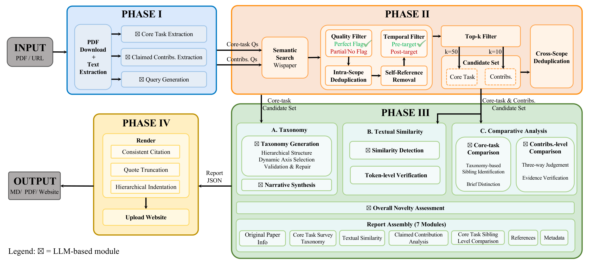

# OpenNovelty（中文）

[](LICENSE)
[](https://arxiv.org/abs/2601.01576)
[](https://huggingface.co/papers/2601.01576)
[](https://www.opennovelty.org)

[English](README.md) | 中文

**OpenNovelty** 是一个基于LLM的Agentic Pipeline，面向学术论文的 **透明、证据化、可验证** 的新颖度评估。

- 网站（公开报告）：https://www.opennovelty.org  
- 技术报告（arXiv）：https://arxiv.org/abs/2601.01576  

> 🌟 **如果您觉得 OpenNovelty 对您有帮助，请在 [GitHub](https://github.com/Zhangbeibei1991/OpenNovelty) 上给我们一个 Star，并在 [Hugging Face](https://huggingface.co/papers/2601.01576) 上点赞支持我们，非常感谢！**

> **仓库状态**：代码将在2个月内渐进重构，提高质量；当前呈现一个demo版本。

---

## 为什么需要 OpenNovelty

新颖度是同行评审的关键维度，但人工评估容易受时间、主观性和检索覆盖度限制。OpenNovelty 通过检索支撑与证据对照，提供可追溯的新颖度分析，帮助减少主观偏差。

---

## 系统架构



*图：OpenNovelty 完整流程 - 从论文输入到报告输出的四阶段处理流程*

### 四阶段总览

| Phase | 功能 | 关键输入 | 关键输出 | 耗时 | 依赖 |
|:-----:|------|---------|---------|:----:|------|
| **I** | 信息抽取 | 论文 PDF URL | `phase1_extracted.json` | ~1 min | LLM API |
| **II** | 文献检索 | Phase 1 输出 | `citation_index.json` | ~10 min | Wispaper API |
| **III** | 深度分析 | Phase 2 输出 | `phase3_complete_report.json` | ~10 min | LLM API |
| **IV** | 报告生成 | Phase 3 输出 | `novelty_report.md/pdf` | ~30 sec | weasyprint |

### 详细说明

**Phase I — 信息抽取**
- 下载 PDF，提取全文和元数据
- LLM 提取核心任务（1个）和贡献点（1-3个）
- 为每个任务/贡献生成 3 条检索查询变体

**Phase II — 文献检索**
- 语义检索相关论文（[WisPaper API](https://wispaper.ai) [[论文]](https://huggingface.co/papers/2512.06879)）
- 质量过滤（完美匹配、时间过滤）、去重（canonical_id + 标题归一化）
- 生成引用索引（核心任务 Top-50、贡献 Top-10）
- ⚠️ **注意**：Phase 2 依赖的 Wispaper API **暂未公开开放**，后续将会放开，敬请关注！

**Phase III — 深度分析**
- 生成相关工作层次分类和综述
- 文本相似度检测（词级模糊匹配，⚠️ 实验性功能，建议跳过）
- 全文对比验证，输出新颖度判断（can_refute/cannot_refute/unclear）
- 💡 **建议配置**：`.env` 中设置 `SKIP_TEXTUAL_SIMILARITY=true` 跳过相似度检测（该实验性功能更新中）

**Phase IV — 报告生成**
- 模板渲染 Markdown/PDF 报告（不调用 LLM）
- 统一引用格式、证据片段展示、层级结构

---

## 快速开始 🚀

### 环境要求

| 类型 | 要求 |
|------|------|
| **操作系统** | Linux (Ubuntu 20.04+) / macOS |
| **Python** | 3.8+ (推荐 3.10+) |
| **内存** | 8GB+ |
| **网络** | 需访问 OpenReview、Wispaper API、LLM API |

### 1️⃣ 安装依赖

```bash
# Ubuntu/Debian 系统依赖
sudo apt-get update && sudo apt-get install -y \
  git curl wget \
  libpango-1.0-0 libpangocairo-1.0-0 libgdk-pixbuf2.0-0 \
  libffi-dev libcairo2 libcairo2-dev libgirepository1.0-dev

# Python 依赖
cd /path/to/pnp_oss
python3 -m venv venv && source venv/bin/activate
pip install -r requirements.txt
```

**主要依赖包**：`requests`, `openai`, `openreview-py`, `pypdf`, `weasyprint`, `python-dotenv`, `tqdm`

### 2️⃣ 配置

创建 `.env` 文件在项目根目录：

```bash
# ============ LLM API 配置（必需）============
export LLM_API_ENDPOINT="https://openrouter.ai/api/v1"           # 示例
export LLM_API_KEY="sk-xxxxxxxx"
export LLM_MODEL_NAME="anthropic/claude-sonnet-4.5"           # 示例

# ============ Wispaper API（Phase 2 必需）============
# Token 默认保存到 ~/.wispaper_tokens.json（首次配置见下方）

# ============ Phase 3 配置（推荐）============
export SKIP_TEXTUAL_SIMILARITY="true"           # 跳过相似度检测（方法研发中）

# ============ 可选配置 ============
export HTTP_PROXY="http://127.0.0.1:7893"         
export HTTPS_PROXY="http://127.0.0.1:7893"
```

#### 🔐 Wispaper 鉴权（首次运行 Phase 2 前）

> ⚠️ **即将开放**：Wispaper API 暂未公开开放，以下配置将在 API 开放后启用。

<!--
**一次配置，长期有效**：

```bash
python scripts/refresh_wispaper_token.py
# → 🌐 自动打开浏览器登录（需先注册：https://wispaper.ai）
# → 💾 Token 保存到 ~/.wispaper_tokens.json
# → 🔄 自动刷新，无需再次操作
```

**自定义 Token 路径**（可选）：
```bash
export WISPAPER_TOKEN_FILE="/your/custom/path/wispaper_tokens.json"
```

**验证配置**：
```bash
python -c "from paper_novelty_pipeline.services.wispaper_client import WispaperClient; WispaperClient()"
# 看到 "Loaded token bundle" 即表示成功
```
-->

### 3️⃣ 运行示例（单篇论文）

以 `https://openreview.net/pdf?id=ZgCCDwcGwn` 为例：

```bash
# Phase 1 - 内容提取（~1 min）
python scripts/run_phase1_batch.py \
  --papers "https://openreview.net/pdf?id=ZgCCDwcGwn" \
  --out-root output/demo \
  --force-year 2026 \
  2>&1 | tee logs/phase1.log

# Phase 2 - 文献检索（~10 min）⚠️ 需要 Wispaper API（即将开放）
bash scripts/run_phase2_concurrent.sh \
  openreview_ZgCCDwcGwn_20260118 \
  --base-dir output/demo \
  2>&1 | tee logs/phase2.log

# Phase 3 - 深度分析（~10 min）
bash scripts/run_phase3_all.sh \
  output/demo/openreview_ZgCCDwcGwn_20260118 \
  2>&1 | tee logs/phase3.log

# Phase 4 - 报告生成（~30 sec）
bash scripts/run_phase4.sh \
  output/demo/openreview_ZgCCDwcGwn_20260118 \
  2>&1 | tee logs/phase4.log

# 查看结果
cat output/demo/openreview_ZgCCDwcGwn_20260118/phase4/novelty_report.md
```

> 💡 **参数说明**：`--papers` 论文 URL | `--out-root` 输出目录 | `--force-year` 强制年份 | `--base-dir` 搜索目录 | `| tee` 保存日志

### 4️⃣ 批量处理

```bash
# 创建论文列表
cat > papers.txt << EOF
https://openreview.net/pdf?id=PAPER_ID_1
https://openreview.net/pdf?id=PAPER_ID_2
https://openreview.net/pdf?id=PAPER_ID_3
EOF

# Phase 1: 批量提取
python scripts/run_phase1_batch.py \
  --paper-file papers.txt \
  --out-root output/batch \
  --force-year 2026

# Phase 2: 批量检索（自动发现所有论文）⚠️ 需要 Wispaper API（即将开放）
bash scripts/run_phase2_concurrent.sh \
  --base-dir output/batch \
  --auto-discover \           # 自动发现 base-dir 下所有已完成 Phase 1 的论文
  --max-workers 10            # 并发数（默认 10，根据机器性能调整）

# Phase 3+4: 批量分析和报告
bash scripts/run_phase3_phase4_serial_pending.sh output/batch
```

> 💡 **参数说明**：
> - `--paper-file`: 论文列表文件（每行一个 URL）
> - `--auto-discover`: 自动扫描目录下所有需要处理的论文
> - `--max-workers`: 并发线程数（Phase 2 检索时并发调用 API）

### 5️⃣ 常用命令

| 命令 | 用途 |
|------|------|
| `python scripts/refresh_wispaper_token.py` | 刷新 Wispaper Token ⚠️（即将开放） |
| `python scripts/run_phase1_batch.py --help` | 查看 Phase 1 帮助 |
| `bash scripts/run_phase2_concurrent.sh --help` | 查看 Phase 2 帮助 ⚠️（即将开放） |
| `cat logs/phase2.log \| grep ERROR` | 定位错误日志 |

---

## 技术参考

### 脚本入口（`scripts/`）

| 脚本 | 功能 | 使用场景 | 耗时 |
|------|------|---------|:----:|
| `run_phase1_batch.py` | 信息抽取 | 单篇/批量 | ~1 min/篇 |
| `run_phase2_concurrent.sh` | 文献检索 ⚠️ | 单篇/批量（即将开放） | ~10 min/篇 |
| `run_phase2_only.py` | 文献检索（单篇）⚠️ | 即将开放 | ~10 min/篇 |
| `run_phase3_all.sh` | 深度分析（7个子步骤） | 单篇/批量 | ~10 min/篇 |
| `run_phase4.sh` | 报告生成 | 单篇 | ~30 sec/篇 |
| `run_phase3_phase4_serial_pending.sh` | 批量补齐 | 自动发现已完成 Phase 2 的论文 | - |
| `refresh_wispaper_token.py` | Token 刷新 ⚠️ | 即将开放 | ~10 sec |

### 目录结构

```bash
output/<run>/<paper_id>/
├── phase1/                         # Phase 1 输出
│   ├── phase1_extracted.json       # ⭐ 核心任务和贡献点（含查询变体）
│   ├── paper.json                  # 论文元数据
│   ├── pub_date.json               # 发布日期
│   ├── fulltext_raw.txt            # PDF 原始全文
│   ├── fulltext_cleaned.txt        # 清洗后全文
│   ├── body_for_core_task.txt      # 核心任务相关文本
│   ├── body_for_claims.txt         # 贡献声明相关文本
│   └── raw_llm_responses/          # 原始 LLM 响应（可复现）
│
├── phase2/final/                   # Phase 2 输出
│   ├── citation_index.json         # ⭐ 引用索引（Phase 3 依赖）
│   ├── core_task_perfect_top50.json # 核心任务候选 Top-50
│   ├── contribution_*_perfect_top10.json # 贡献候选 Top-10
│   ├── stats.json                  # 搜索统计
│   └── raw_responses/              # 原始 API 响应
│
├── phase3/                         # Phase 3 输出
│   ├── phase3_complete_report.json # ⭐ 完整分析报告（Phase 4 依赖）
│   ├── core_task_survey/           # 分类体系和综述
│   ├── core_task_comparisons/      # 核心任务对比
│   ├── contribution_analysis/      # 贡献点分析
│   ├── textual_similarity_detection/ # 文本相似度检测
│   ├── cached_paper_texts/         # 缓存的论文全文
│   └── raw_llm_responses/          # 原始 LLM 响应
│
└── phase4/                         # Phase 4 输出
    ├── novelty_report.md           # ⭐ Markdown 报告
    └── novelty_report.pdf          # PDF 报告（需要 weasyprint）
```

> ⭐ 标记的文件是下一阶段的**必需输入**

---

## 故障排除 🔧

### 常见问题

| 问题 | 症状 | 解决方案 |
|------|------|---------|
| **Wispaper Token 过期** | `401 Unauthorized` / `Token expired` | ⚠️ Wispaper API 即将开放 |
| **PDF 下载失败** | `ConnectionError` / `Timeout` | 检查网络连接、URL 正确性、代理设置 |
| **LLM API 调用失败** | `API Error` / `Invalid key` | 检查 `.env` 中的 `LLM_API_KEY`、`LLM_MODEL_NAME`、API 额度 |
| **PDF 生成失败** | `weasyprint error` | `sudo apt-get install libpango-1.0-0 libpangocairo-1.0-0 libgdk-pixbuf2.0-0` |
| **Phase 3 长时间无响应** | 超过 5 分钟无输出 | 正常现象，单个子步骤可能需要 2-5 分钟，耐心等待 |
| **Phase 1 年份检测失败** | `Year extraction failed` | 使用 `--force-year YYYY` 强制指定年份 |

### 调试技巧

**查看详细日志**：
```bash
# 定位错误
cat logs/phase2.log | grep -i error

# 查看 API 调用
cat logs/phase3.log | grep "LLM call"

# 检查文件生成
ls -lh output/demo/openreview_XXX/phase2/final/
```

**重跑失败的子步骤**（Phase 3）：
```bash
# 单独重跑分类生成
python -m scripts.run_phase3_taxonomy \
  --phase2-dir output/demo/openreview_XXX/phase2 \
  --out-dir output/demo/openreview_XXX \
  --log-level INFO

# 单独重跑对比分析
python -m scripts.run_phase3_core_task_comparisons \
  --phase1-dir output/demo/openreview_XXX/phase1 \
  --phase2-dir output/demo/openreview_XXX/phase2 \
  --out-dir output/demo/openreview_XXX \
  --resume \
  --log-level INFO
```

**验证配置**：
```bash
# 检查环境变量
echo "LLM_API_KEY: ${LLM_API_KEY:0:10}..."
echo "LLM_MODEL_NAME: $LLM_MODEL_NAME"

# 验证 Wispaper Token（⚠️ 即将开放）
# python -c "from paper_novelty_pipeline.services.wispaper_client import WispaperClient; client = WispaperClient(); print('Token valid!')"

# 检查 Phase 1 输出
cat output/demo/openreview_XXX/phase1/phase1_extracted.json | jq '.core_task'
```

---

## 引用

```bibtex
@article{zhang2026opennovelty,
  title={OpenNovelty: An LLM-powered Agentic System for Verifiable Scholarly Novelty Assessment},
  author={Zhang, Ming and Tan, Kexin and Huang, Yueyuan and Shen, Yujiong and Ma, Chunchun and Ju, Li and Zhang, Xinran and Wang, Yuhui and Jing, Wenqing and Deng, Jingyi and others},
  journal={arXiv preprint arXiv:2601.01576},
  year={2026}
}
```

---

## 许可

项目遵循 **Apache License 2.0**，详见 [`LICENSE`](LICENSE)。

---

## 免责声明

所有报告基于检索到的文献与大模型生成，覆盖度受检索召回限制，结论仅供参考，不构成最终的新颖度判定。OpenNovelty 旨在提供透明、证据化的辅助，不替代人工评审。

---

## 联系方式

- Ming Zhang: [mingzhang23@m.fudan.edu.cn](mailto:mingzhang23@m.fudan.edu.cn)  
- Kexin Tan: [kxtan18@fudan.edu.cn](mailto:kxtan18@fudan.edu.cn) or [bluellatan@gmail.com](mailto:bluellatan@gmail.com) 
